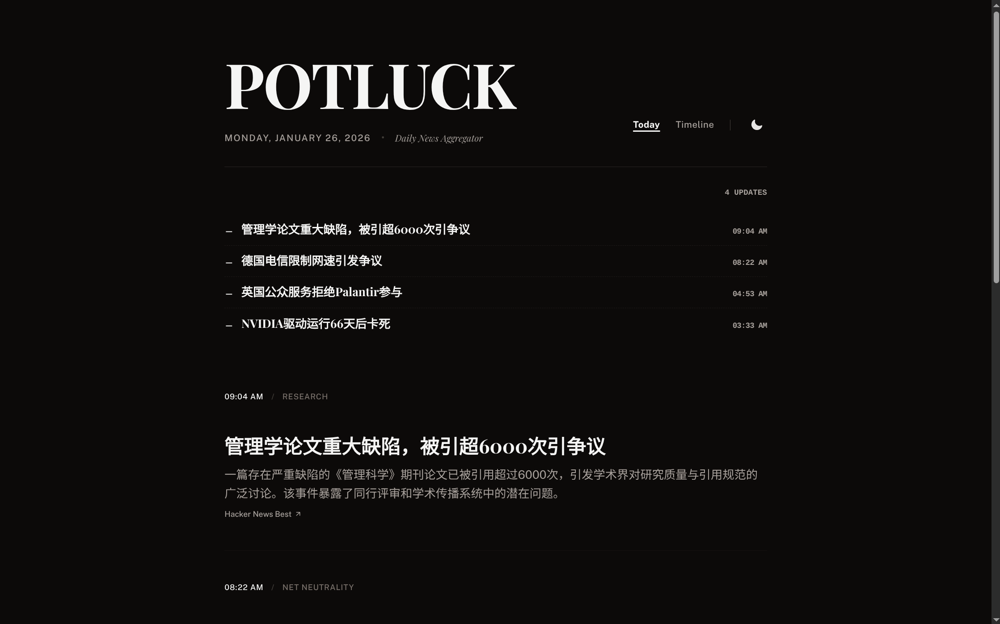
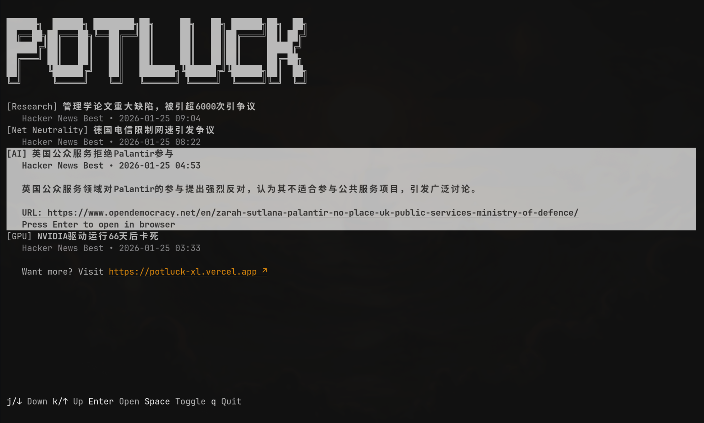

# 🍲 Potluck

> AI-powered tech news digest — Curated, summarized, delivered.

[](https://nuxt.com)
[](https://supabase.com)
[](https://deepseek.com)

## 📸 Screenshots

| Web | Terminal |
|-----|----------|
|  |  |

## ✨ Features

- 📰 **Auto RSS Ingestion** — Fetches tech news from multiple sources
- 🤖 **AI Summarization** — Generates concise Chinese titles & summaries
- 📱 **Clean UI** — Minimal, newspaper-inspired design with dark mode
- ♾️ **Infinite Scroll** — Browse history seamlessly on Timeline page

## 🚀 Quick Start

### Prerequisites

- Node.js 20+
- [pnpm](https://pnpm.io)
- [Docker](https://docker.com) (for local Supabase)
- [DeepSeek API Key](https://platform.deepseek.com)

### Setup

```bash
# 1. Install dependencies
pnpm install

# 2. Start local Supabase
pnpm supabase start

# 3. Configure environment
cp .env.example .env.local
# Edit .env.local with your keys (see Supabase output)

# 4. Run dev server
pnpm dev
```

Open [http://localhost:3000](http://localhost:3000)

### Trigger Data Ingestion

```bash
curl -X POST http://localhost:3000/api/ingest \
  -H "Authorization: Bearer <your-ingest-key>"
```

## 📡 API

| Endpoint | Method | Auth | Description |
|----------|--------|------|-------------|
| `/api/latest` | GET | — | Get latest articles with pagination |
| `/api/timeline` | GET | — | Cursor-based infinite scroll |
| `/api/ingest` | POST | Bearer | Trigger RSS fetch + AI processing |

## 🏗️ Tech Stack

- **Framework**: [Nuxt 4](https://nuxt.com) + [Nuxt UI](https://ui.nuxt.com)
- **Database**: [Supabase](https://supabase.com) (Postgres)
- **AI**: [DeepSeek](https://deepseek.com)
- **Styling**: [Tailwind CSS](https://tailwindcss.com)

## 📄 License

MIT
